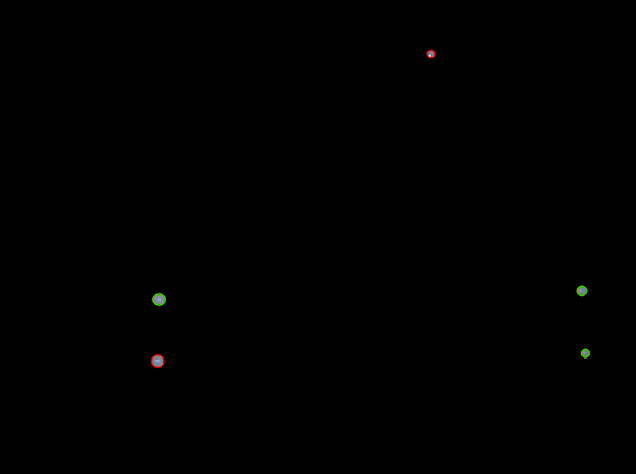

# Adaptive Landmark Color for AUV Docking in Visually Dynamic Environments

## Dependencies

**Ubuntu 20.04** <br>
ROS Noetic <br>
opencv-python (tested with version 4.9.0.80) <br>

**Python 3.8** <br>
cv-bridge (tested with version 1.16.2) <br>
numpy (tested with version 1.24.4) <br>

A Docker image with all necessary software packages installed is available on [DockerHub here](https://hub.docker.com/repository/docker/rogueraptor7/ros-noetic/general) 
and the `run-container.sh` script is provided to run the example code. It is not necessary to install ROS 1 or the specific Python packages to run the Docker container.

On a system with a valid Docker configuration, simply run the following command to be dropped into a shell with all necessary software installed
```
./run-container.sh
```

## Usage

### Use in your existing `catkin_ws`

1. Clone this repository
```
git clone https://github.com/IRVLab/adaptive_landmarks.git
```

2. Move the `adaptive_landmarks` package from this repo into your `catkin_ws/src` directory
```
mv adaptive_landmarks/catkin_ws/src/adaptive_landmarks catkin_ws/src/
```

3. (Optional) Add the following lines to your existing launch file to launch the nodes. Replace `CAMERA_TOPIC` with
your desired camera topic.
```
<node pkg="adaptive_landmarks" type="adaptive_color_node.py" name="adaptive_color_node" output="screen">
    <param name="camera_topic" value="CAMERA_TOPIC"/>
</node>
<node pkg="adaptive_landmarks" type="blob_detector_node.py" name="blob_detector_node" output="screen">
    <param name="camera_topic" value="CAMERA_TOPIC"/>
</node>
```

By default, the `adaptive_color` node calculates the ternary marker color. To change this to the complementary marker color, 
edit the `catkin_ws/src/adaptive_landmarks/src/adaptive_color_node.py`, line 39, and change the shift to `shift=180`.

### Run on the example bag

It is recommended to run commands in a Docker container to ensure compatibility.


1. Clone this repository
```
git clone https://github.com/IRVLab/adaptive_landmarks.git
```

2. Build the catkin_ws
```
cd adaptive_landmarks
./run-container.sh
cd catkin_ws
catkin_make
```

3. In the same terminal, launch the robot_meta `detect_only.launch` file
```
source devel/setup.bash
roslaunch robot_meta detect_only.launch
```
4. In terminal 2, play the example bag file
```
cd adaptive_landmarks
./run-container.sh
rosbag play -l example.bag
```
5. In terminal 3, open rqt_image_view and view the `/blob_detector/image` topic for the detected docking station markers.
```
cd adaptive_landmarks
./run-container.sh
rqt_image_view
```


